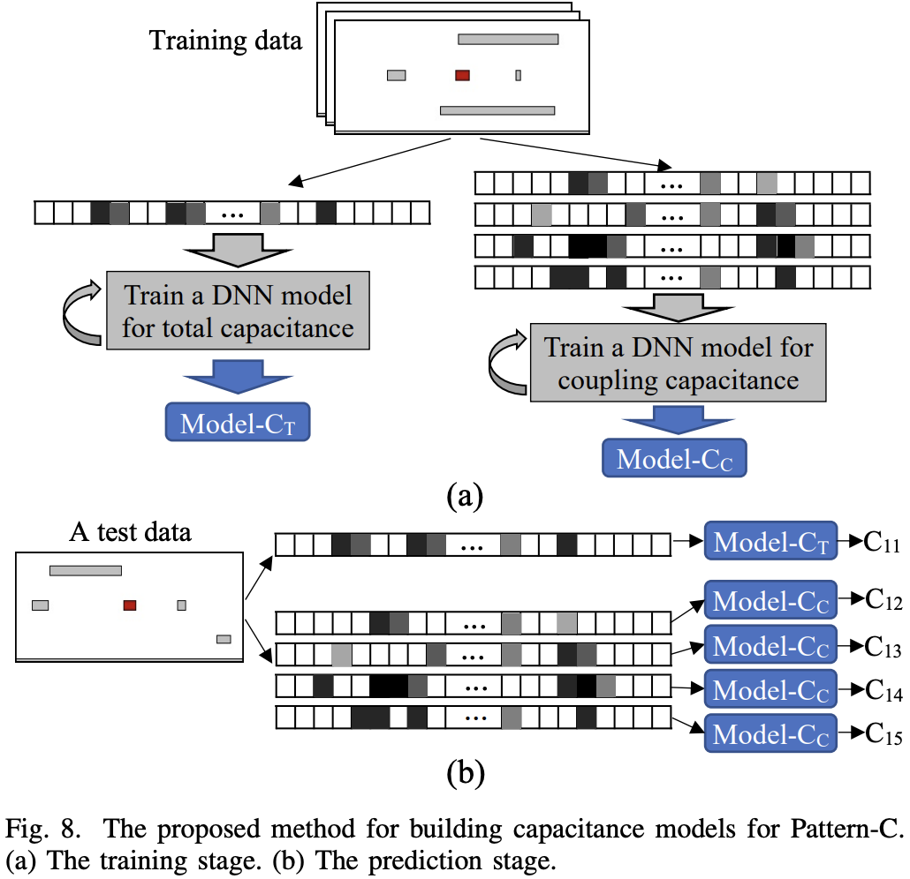

## CNN-Cap

This repository is the official repository for our paper "CNN-Cap: Effective convolutional neural network based capacitance models for full-chip parasitic extraction" and "CNN-Cap: Effective convolutional neural network based capacitance models for interconnect capacitance extraction". These repository provides several datasets and models for 2-D and 3-D interconnect capacitance extraction.

<p align="center">
  
</p>

## Installatin

* git clone git@github.com:ydc123/CNNCap.git
* pip install -r requirements.txt

## Data Preparation

For the 2-D pattern, we generated 10 datasets on 5 layer combinations, consisting of Pattern-B and Pattern-C. Please refer to `dataset.py` to learn how to load these datasets. For each datasets, we provide 2 models to predict the total capacitance and coupling capacitance respectively. 

The code and data for 3-D pattern will be released soon.

We have released these datasets and models on Baidu Netdist ([link, 链接](https://pan.baidu.com/s/18MhVy8RGy75B2q5Pj_Pf5w) with password 6sp8). After downloading and extracting the compressed file, you will get the following files:
```
data
├── 15nm_B_2_4_6.json
├── 15nm_B_2_4_9.json
├── 15nm_B_3_6_8.json
├── 15nm_C_2_4_6.json
├── 15nm_C_2_4_9.json
├── 15nm_C_3_6_8.json
├── 55nm_B_2_3_6.json
├── 55nm_B_2_4_6.json
├── 55nm_C_2_3_6.json
└── 55nm_C_2_4_6.json
saved_models
├── best.model_CNNCap_mse_15nm_B_2_4_6_total.pth.tar
├── best.model_CNNCap_mse_15nm_B_2_4_9_total.pth.tar
├── best.model_CNNCap_mse_15nm_B_3_6_8_total.pth.tar
├── best.model_CNNCap_mse_15nm_C_2_4_6_total.pth.tar
├── best.model_CNNCap_mse_15nm_C_2_4_9_total.pth.tar
├── best.model_CNNCap_mse_15nm_C_3_6_8_total.pth.tar
├── best.model_CNNCap_mse_55nm_B_2_3_6_total.pth.tar
├── best.model_CNNCap_mse_55nm_B_2_4_6_total.pth.tar
├── best.model_CNNCap_mse_55nm_C_2_3_6_total.pth.tar
├── best.model_CNNCap_mse_55nm_C_2_4_6_total.pth.tar
├── best.model_CNNCap_msre_15nm_B_2_4_6_env.pth.tar
├── best.model_CNNCap_msre_15nm_B_2_4_9_env.pth.tar
├── best.model_CNNCap_msre_15nm_B_3_6_8_env.pth.tar
├── best.model_CNNCap_msre_15nm_C_2_4_6_env.pth.tar
├── best.model_CNNCap_msre_15nm_C_2_4_9_env.pth.tar
├── best.model_CNNCap_msre_15nm_C_3_6_8_env.pth.tar
├── best.model_CNNCap_msre_55nm_B_2_3_6_env.pth.tar
├── best.model_CNNCap_msre_55nm_B_2_4_6_env.pth.tar
├── best.model_CNNCap_msre_55nm_C_2_3_6_env.pth.tar
└── best.model_CNNCap_msre_55nm_C_2_4_6_env.pth.tar
data
├── 15nm_B_2_4_6.json
├── 15nm_B_2_4_9.json
├── 15nm_B_3_6_8.json
├── 15nm_C_2_4_6.json
├── 15nm_C_2_4_9.json
├── 15nm_C_3_6_8.json
├── 55nm_B_2_3_6.json
├── 55nm_B_2_4_6.json
├── 55nm_C_2_3_6.json
└── 55nm_C_2_4_6.json
```

## Running Commands for 2-D Pattern

You can run the following command to predict the total capacitance of 15nm_B_2_4_6 dataset with the model we provide.

``
python test.py --model saved_models/best.model_CNNCap_mse_15nm_B_2_4_6_total.pth.tar --logfile log/log_eval_model_CNNCap_mse_15nm_B_2_4_6_total.txt --data_path data/15nm_B_2_4_6.json --goal total
``

You can also train a model for predicting dominant capacitance on the 15nm_B_2_4_6 dataset by running the following command.

``
python train.py --lr 1e-5 --batch_size 64 --savename model_tmp.pth --logfile log/log_tmp.txt --epoch 1 --goal env --data_path data/55nm_C_2_3_6.json --loss msre 
``

For more details on training and testing code, please refer to `train.py` and `test.py`.

## Running Commands for 3-D Pattern

The code and data for 3-D pattern will be released soon.

## Citation

If you benefit from our work in your research, please consider to cite the following paper:
```
@inproceedings{yang2021cnn,
  title={CNN-Cap: Effective convolutional neural network based capacitance models for full-chip parasitic extraction},
  author={Yang, Dingcheng and Yu, Wenjian and Guo, Yuanbo and Liang, Wenjie},
  booktitle={2021 IEEE/ACM International Conference On Computer Aided Design (ICCAD)},
  pages={1--9},
  year={2021},
  organization={IEEE}
}
@article{yang2022cnn,
  title={CNN-Cap: Effective Convolutional Neural Network Based Capacitance Models for Interconnect Capacitance Extraction},
  author={Yang, Dingcheng and Li, Haoyuan and Yu, Wenjian and Guo, Yuanbo and Liang, Wenjie},
  journal={ACM Transactions on Design Automation of Electronic Systems (TODAES)},
  year={2022},
  publisher={ACM New York, NY}
}
```

Please feel free to contact us if you have any questions.